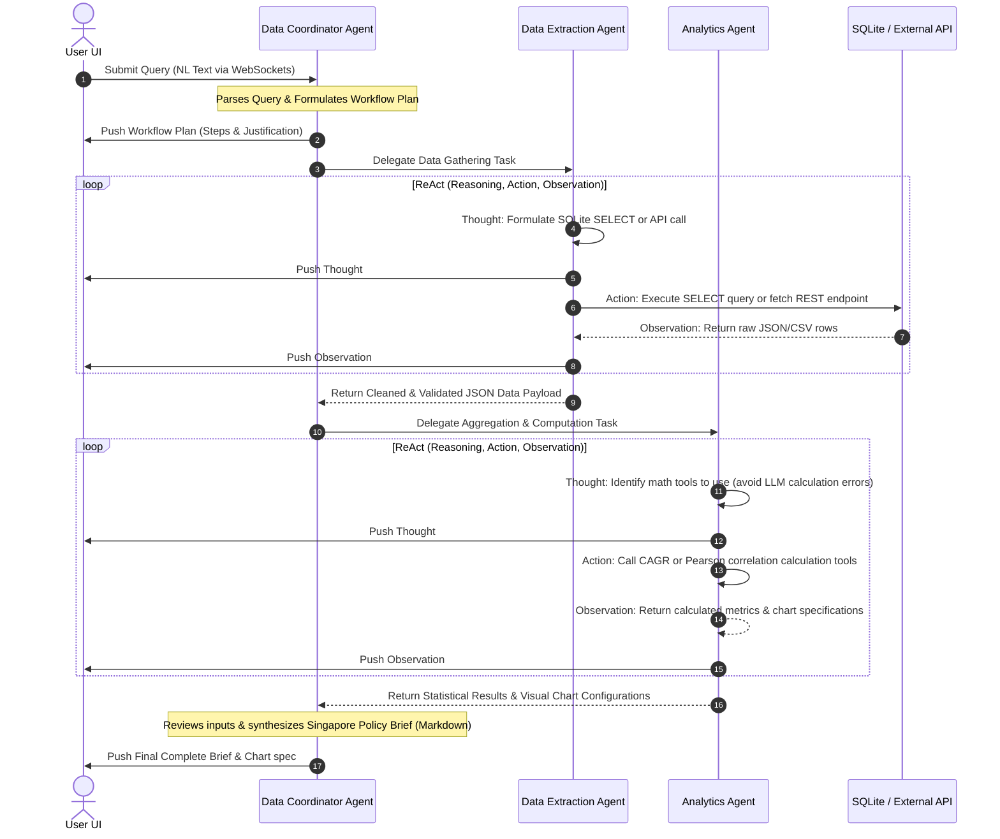

# ARCHITECTURE.md: GovTech Agentic Policy Analytics Platform

An overview of the system architecture, multi-agent orchestrator design, database schemas, and technical decisions implemented for the Agentic Policy Data Analytics Platform.

---

## 1. System Topology

The platform is designed around a decoupled, full-stack containerized structure linked through real-time communication:

```
                                  +------------------------------------+
                                  |     Vite React TS Client (UI)      |
                                  |   (Glassmorphic Terminal & Charts) |
                                  +-----------------+------------------+
                                                    |
                                     HTTP Requests  |  WebSocket Stream
                                     & History APIs |  (Real-Time Agent Monologue)
                                                    v
                                  +-----------------+------------------+
                                  |       FastAPI Web Server API       |
                                  |    (Uvicorn / Asynchronous Task)    |
                                  +--------+------------------+--------+
                                           |                  |
                                           | Database Query   | Fallback API Call
                                           v                  v
                            +--------------+---+      +-------+----------+
                            | SQLite Local DB  |      | Resilient LLM    |
                            | (seeded stats)   |      | Wrapper (OpenAI  |
                            +------------------+      | & GCP Gemini)    |
                                                      +------------------+
```

---

## 2. Asynchronous Multi-Agent ReAct Workflow

To achieve true autonomous planning and error-resilient analytical processing, we implemented a custom event-driven multi-agent network orchestrated by a central coordinator:



### Cooperation Nodes
1. **Data Coordinator Agent:** Serves as the system architect. Translates the query, delegates execution, validates and runs semantic review checks, and synthesizes the finalized Singapore Policy Brief report with citations.
2. **Data Extraction Agent:** Focuses on secure extraction and cleaning. Explores schemas dynamically, generates strict SELECT queries, calls external mock endpoints, handles missing cells, and formats JSON outputs.
3. **Analytics Agent:** Offloads mathematical computations. Executes growth calculations, correlation tests, flags trends, and generates JSON charting schemas for Recharts.

---

## 3. Database Schema Design

The application utilizes a localized **SQLite** database managed through SQLAlchemy ORM.

### Analytical Tables
* **`mom_employment`** (Ministry of Manpower statistics):
  - `id`: INTEGER (Primary Key)
  - `year`: INTEGER (2020-2024)
  - `sector`: VARCHAR (e.g., 'Technology', 'Healthcare')
  - `employment_change`: INTEGER (Annual net headcount change)
  - `unemployment_rate`: FLOAT (Percentage index)
  - `median_salary`: FLOAT (Monthly base SGD salary)

* **`singstat_population`** (Department of Statistics demographic metrics):
  - `id`: INTEGER (Primary Key)
  - `year`: INTEGER (2020-2024)
  - `resident_population`: INTEGER (Total count)
  - `median_age`: FLOAT (Demographic age)
  - `dependency_ratio`: FLOAT (Dependency scale)

* **`singstat_cpi`** (Consumer Price Index for inflation checks):
  - `id`: INTEGER (Primary Key)
  - `year`: INTEGER (2020-2024)
  - `month`: VARCHAR (e.g., 'Jan', 'Feb')
  - `cpi_index`: FLOAT (Normalized CPI index value)
  - `category`: VARCHAR (e.g., 'All Items', 'Food')

### System State & Tracking Tables
* **`analysis_requests`** (Tracks user requests):
  - `id`: VARCHAR (Primary Key UUID)
  - `user_query`: TEXT (Raw NL prompt)
  - `status`: VARCHAR (pending, processing, completed, failed)
  - `created_at`: DATETIME
* **`agent_logs`** (Archived step-by-step agent monologue sequences):
  - `id`: INTEGER (Primary Key)
  - `request_id`: VARCHAR (Foreign Key to analysis_requests)
  - `agent_name`: VARCHAR (Coordinator, Extractor, Analyst)
  - `step_type`: VARCHAR (thought, action, observation)
  - `content`: TEXT (Agent monologues or outputs)
  - `created_at`: DATETIME
* **`analysis_results`** (Archived completed briefs):
  - `id`: VARCHAR (Primary Key UUID)
  - `request_id`: VARCHAR (Foreign Key to analysis_requests, unique)
  - `final_report`: TEXT (Markdown report content)
  - `chart_data`: TEXT (JSON string of visual coordinates)
  - `created_at`: DATETIME

---

## 4. Key Architectural Decisions

1. **Custom ReAct Agent Loop vs Frameworks:** We avoided older CrewAI and LangGraph packages because their installation on Windows machines often triggers version mismatches and dependency compilation errors. By engineering a custom, lightweight, event-driven ReAct core, we guaranteed zero dependency conflicts and achieved absolute transparency in streaming intermediate agent steps over WebSockets.
2. **Deterministic Mathematical Offloading:** LLMs are notorious for failing at simple arithmetic (e.g., calculating CAGR or decimal correlation). We engineered explicit math tools (`calculate_correlation` and `calculate_growth_rate`) that are programmatically executed by Python. The agent acts only as a decision-maker on when to run these tools, ensuring 100% mathematical accuracy.
3. **Multi-cloud Resilience Wrapper:** To avoid single-point API failures, our LLM wrapper implements automatic cloud fallback (`OpenAI GPT-4o-mini` -> `GCP Gemini 1.5 Flash`) and hosts a rich Offline Heuristics Mock engine that reads raw data from SQLite and constructs realistic outputs. This ensures the demo runs perfectly even without internet access or paid API keys.
4. **Nginx High-performance Static Serving:** The React SPA compiled by Vite is served in production inside a dedicated Nginx server container. This keeps the frontend container image size under 25MB and provides enterprise-level loading speeds and resource security.
